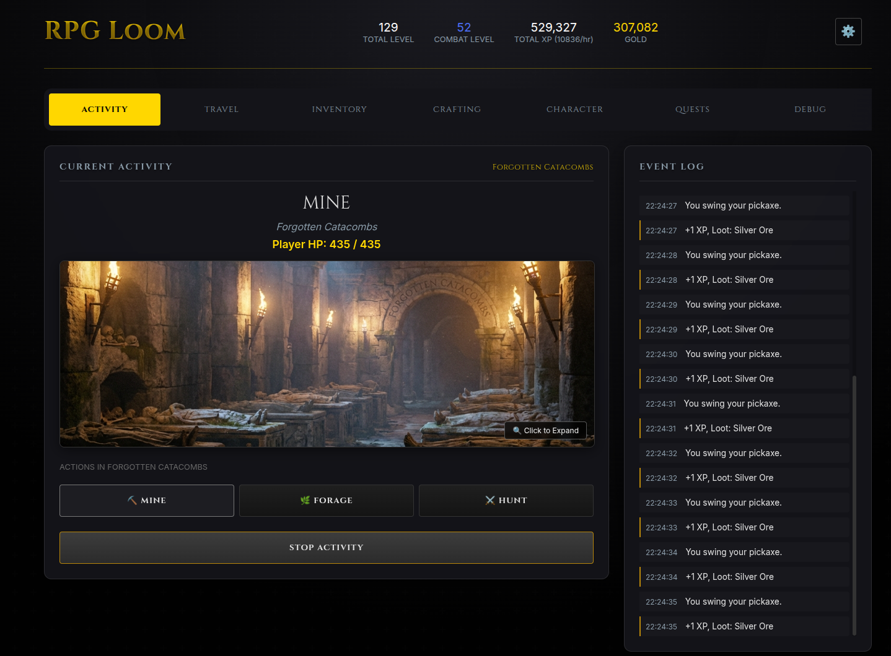

# RPG Loom

A deterministic **incremental RPG** with **AI-powered dynamic content generation**.

The core game runs fully **without AI**. When enabled, AI generates unique adventure quests, enhances quest narratives, and adds flavor to the game world — while maintaining deterministic gameplay mechanics.

## YouTube Videos

**Dev Log:**

* [RPG Loom - Project Start](https://www.youtube.com/watch?v=In-FWxJHEmI)
* [Automated Game Development](https://youtu.be/bPcV4SZ55VE)

**Overview:**
* [Overview](https://youtu.be/zLZlTV3oJJM)




## 🎮 Current Status: Feature-Complete Alpha

**Core Systems:**

- ✅ **Deterministic Engine**: Reproducible game state with seeded RNG
- ✅ **Combat System**: Multi-tick combat with tactics, equipment, and skills
- ✅ **Crafting & Gathering**: Mining, woodcutting, foraging, and smithing
- ✅ **Quest System**: Daily quests, quest chains, and AI-generated adventures
- ✅ **Progression**: Skill-based leveling, equipment tiers, and reputation
- ✅ **Persistence**: Auto-save with import/export functionality

**AI Features:**

- ✅ **AI-Generated Adventure Quests**: Dynamic multi-location quests with unique narratives
- ✅ **Quest Enhancement**: AI rewrites quest descriptions for variety
- ✅ **Multi-Provider Support**: Gemini (CLI/Cloud), OpenAI, Claude, and more
- ✅ **AI Settings Menu**: Configure provider and model preferences
- ✅ **AI Debug Console**: Troubleshoot generation with detailed logging

**UI & UX:**

- ✅ **Tabbed Navigation**: Activity, Travel, Inventory, Crafting, Character, Quests
- ✅ **Real-time Updates**: Live event log with smart message merging
- ✅ **Equipment Manager**: Visual equipment grid with drag-to-equip
- ✅ **Quest Tracking**: Progress bars, step indicators, and location requirements
- ✅ **Debug Tools**: Tick rate control, skill reset, and item spawner

## Key Features

### Quest System

- **Daily Quests**: 24-hour cooldown quests for consistent rewards
- **Quest Chains**: Sequential multi-part quests that unlock progressively
- **AI Adventures**: Dynamically generated 3-5 step adventures with:
  - Multi-location progression
  - Time-based completion (2-5 minutes)
  - Contextual narratives based on player level and location
  - Scaled rewards (XP, gold, items)

### AI Integration

- **Multi-Provider LLM Support**: 
  - Gemini (CLI & Cloud API)
  - OpenAI (GPT-4, GPT-5)
  - Claude (CLI & Cloud API)
  - Codex CLI
  - Mock backend for testing
- **Configurable Settings**: Choose provider and model from Settings menu
- **Debug Console**: Test AI generation with detailed output logs
- **Graceful Degradation**: Game remains fully playable without AI

### Deterministic Gameplay

- **Seeded RNG**: All randomness is reproducible with save state
- **Command-Event Architecture**: UI sends commands, engine emits events
- **Offline Simulation**: Catch-up mechanics for time spent away
- **No AI in Core Loop**: AI only affects narrative, never game mechanics

## Monorepo Layout

- `web/` — React (Vite) client UI
- `gateway/` — Node API for LLM integration with multi-provider support
- `sdk/` — Typed client for the gateway
- `packages/engine/` — Deterministic simulation engine
- `packages/content/` — JSON content packs (items, enemies, locations, quests, recipes)
- `packages/shared/` — Shared types, Zod schemas, and utilities
- `docs/` — Development log, specs, and architecture

## Requirements

- **Node.js** LTS (recommended: 20+)
- **npm** or **pnpm**

### Optional (for AI features)

- **Gemini CLI** (recommended): `npm install -g @google/gemini-cli`
- **API Keys** for Cloud providers (Gemini, OpenAI, Claude)

## Quick Start

```bash
npm install

# Terminal A - Start the gateway
npm run dev:gateway

# Terminal B - Start the web client
npm run dev:web
```

Open the web app at: `http://localhost:5173`

## AI Configuration

### Using Gemini CLI (Recommended)

1. **Install Gemini CLI:**
```bash
npm install -g @google/gemini-cli
```

2. **Authenticate:**
```bash
gemini auth
```

3. **Configure in-game:**

   - Click Settings (⚙️) in the top right
   - Under "AI Settings", select `gemini-cli` as provider
   - Choose `gemini-3-flash-preview` as model
   - Click "🔧 Open AI Debug Console" to test

### Using Cloud APIs

Set environment variables for your chosen provider:

```bash
# Gemini Cloud API
export GEMINI_API_KEY="your-key-here"

# OpenAI
export OPENAI_API_KEY="your-key-here"

# Claude
export ANTHROPIC_API_KEY="your-key-here"
```

Then configure the provider in Settings → AI Settings.

## Development Guidelines

### Engine Rules

- **No `Math.random()`** in `packages/engine` (use seeded RNG)
- **No wall-clock reads** inside engine functions (time is passed as input)
- **Deterministic state transitions** for reproducibility

### AI Integration Rules

- **JSON-only outputs** with schema validation
- **Cannot invent content IDs** (must use existing items/enemies/locations)
- **Narrative only** - AI never affects game mechanics or outcomes
- **Graceful fallbacks** when AI is unavailable

## Documentation

- `docs/dev_log.md` — Development history and feature log
- `docs/PLAN.md` — Milestone plan
- `docs/TECH_STACK.md` — Technology choices
- `docs/ARCHITECTURE.md` — System architecture

## License

MIT


